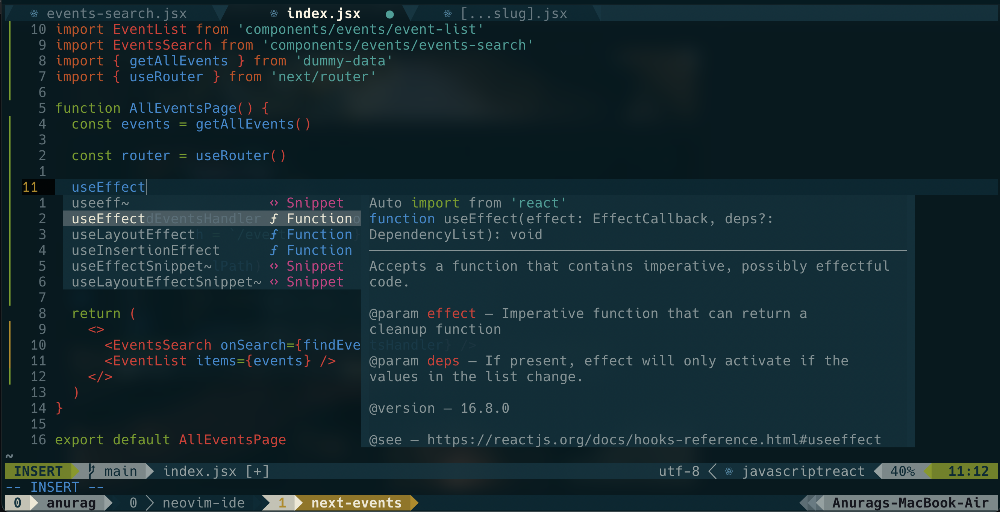

# Neovim Setup



**IMPORTANT:** Don’t blindly use my settings unless you know what that entails. Proceed at your own risk!

This repo is a fork of [josean-dev/dev-environment-files](https://github.com/josean-dev/dev-environment-files) with some extra neovim plugins, theme and keybinds that I personally prefer. Most of the keybinds are same as the YouTube video. Kindly check the config file to see the changes.

Check out this amazing 📹 Youtube video by [Josean Martinez](https://www.youtube.com/channel/UC_NZ6qLS9oJgsMKQhqAkg-w) Step-by-Step Guide: [How I Setup Neovim On My Mac To Make It Amazing](https://youtu.be/vdn_pKJUda8)

# Neovim Setup

### Requires

- True Color Terminal Like (macOS) : [iTerm2](https://iterm2.com/) - Terminal for macOS.
- True Color terminal Like (Linux) : [Alacritty Terminal](https://alacritty.org/) - Terminal for Linux written in Rust.
- True Color terminal Like (WSL) : [Windows Terminal](https://apps.microsoft.com/store/detail/windows-terminal/9N0DX20HK701?hl=en-in&gl=in) - Terminal for WSL.
- [Neovim](https://neovim.io/) (Version 0.8 or Later)
- [Nerd Font](https://github.com/ryanoasis/nerd-fonts) - I use Hack Nerd Font. Check the link for more nerd fonts.
- [Ripgrep](https://github.com/BurntSushi/ripgrep) - For Telescope Fuzzy Finder.
- [Tree-sitter](https://tree-sitter.github.io/tree-sitter/) - Treesitter cli for tree-sitter plugin.

If you're on mac, linux or WSL, you can install iTerm2 (**macOS only**), Neovim and Ripgrep with [homebrew](https://brew.sh/).
Check out the [homebrew](https://brew.sh/) on how to install.

```bash
brew install --cask iterm2
```

```bash
brew install neovim
```

```bash
brew install ripgrep
```

```bash
brew install tree-sitter
```

### Relevant Files

- Copy the nvim directory into your ~/.config.

## Basic Keybinds

- The leader prefix key is assigned to `space`.
- To escape into normal mode use `esc` or `jj`.
- Open Telescope file explorer - `<leader>e`.
- Open nvim-tree file explorer - `<leader>b`.

## Basic Setup

#### The leader key is bind to `space`.<br> Check `~/.config/nvim/lua/user/core/keymaps.lua`

#### Some plugins might be disabled as they are commented.

##### Uncomment the plugins and save the `~/.config/nvim/lua/user/plugins-setup.lua` to install via packer.<br>

##### Check `~/.config/nvim/init.lua` for commented plugins. <br>

#### Install LSP

Enter `:LspInstall` followed by the name of the server you want to install. Check [neovim/nvim-lspconfig](https://github.com/neovim/nvim-lspconfig/blob/master/doc/server_configurations.md) documentation.<br>
Example: `:LspInstall javascript`<br>
Or mason can be used to install lsp, dap etc. <br> **Mason has been configured in such a way that it will automatically install lsp servers from the lsp config file - `~/.config/nvim/lua/user/plugins/lsp/lspconfig.lua`** <br>
Enter `:Mason` to install, update and delete lsp, dap etc. <br>
For more check mason docs - [mason.nvim](https://github.com/williamboman/mason.nvim)

#### Install language parser

Enter `:TSInstall` followed by the name of the language you want to install<br>
Example: `:TSInstall typescript` <br>
Check the file `~/.config/nvim/lua/user/plugins/treesitter.lua` to install language parsers with `:TSUpdate`

#### Manage plugins

Run `:PackerClean` to remove any disabled or unused plugins<br>
Run `:PackerSync` to update and clean plugins<br>

Also manually saving the `~/.config/nvim/lua/user/plugins-setup.lua` file updates the plugins to it's latest version.

## Plugins

#### Plugin Manager

- [wbthomason/packer](https://github.com/wbthomason/packer.nvim) - Popular plugin manager

#### Dependency For Other Plugins

- [nvim-lua/plenary](https://github.com/nvim-lua/plenary.nvim) - Useful lua functions other plugins use

#### Preferred Colorscheme (use any one of the below)

- [bluz71/vim-nightfly-guicolors](https://github.com/bluz71/vim-nightfly-guicolors) - Dark Colorscheme
- [svrana/neosolarized.nvim](https://github.com/svrana/neosolarized.nvim) - Neosolarized theme for Neovim

#### Navigating Between Neovim Windows and Tmux

- [christoomey/vim-tmux-navigator](https://github.com/christoomey/vim-tmux-navigator)

#### Essentials

- [tpope/vim-surround](https://github.com/tpope/vim-surround) - manipulate surroundings with "ys", "ds", and "cs"
- [inkarkat/vim-ReplaceWithRegister](https://github.com/inkarkat/vim-ReplaceWithRegister) - replace things with register with "gr"
- [numToStr/Comment.nvim](https://github.com/numToStr/Comment.nvim) - toggle comments with "gc"

#### File Explorer

- [nvim-tree/nvim-tree.lua](https://github.com/nvim-tree/nvim-tree.lua)

#### VS Code Like Icons

- [nvim-tree/nvim-web-devicons](https://github.com/nvim-tree/nvim-web-devicons)

#### Status Line

- [nvim-lualine/lualine.nvim](https://github.com/nvim-lualine/lualine.nvim)

#### Fuzzy Finder

- [nvim-telescope/telescope-fzf-native.nvim](https://github.com/nvim-telescope/telescope-fzf-native.nvim) - Dependency for better performance
- [nvim-telescope/telescope.nvim](https://github.com/nvim-telescope/telescope.nvim) - Fuzzy Finder

#### Autocompletion

- [hrsh7th/nvim-cmp](https://github.com/hrsh7th/nvim-cmp) - Completion plugin
- [hrsh7th/cmp-buffer](https://github.com/hrsh7th/cmp-buffer) - Completion source for text in current buffer
- [hrsh7th/cmp-path](https://github.com/hrsh7th/cmp-path) - Completion source for file system paths

#### Snippets

- [L3MON4D3/LuaSnip](https://github.com/L3MON4D3/LuaSnip) - Snippet engine
- [rafamadriz/friendly-snippets](https://github.com/rafamadriz/friendly-snippets) - Useful snippets for different languages
- [saadparwaiz1/cmp_luasnip](https://github.com/saadparwaiz1/cmp_luasnip) - Completion source for snippet autocomplete

#### Managing & Installing Language Servers, Linters & Formatters

- [williamboman/mason.nvim](https://github.com/williamboman/mason.nvim)

#### LSP Configuration

- [williamboman/mason-lspconfig.nvim](https://github.com/williamboman/mason-lspconfig.nvim) - Bridges gap b/w mason & lspconfig
- [neovim/nvim-lspconfig](https://github.com/neovim/nvim-lspconfig) - Easy way to configure lsp servers
- [hrsh7th/cmp-nvim-lsp](https://github.com/hrsh7th/cmp-nvim-lsp) - Smart code autocompletion with lsp
- [glepnir/lspsaga.nvim](https://github.com/glepnir/lspsaga.nvim) - Enhanced uis for lsp
- [jose-elias-alvarez/typescript.nvim](https://github.com/jose-elias-alvarez/typescript.nvim) - Additional functionality for typescript server
- [onsails/lspkind.nvim](https://github.com/onsails/lspkind.nvim) - Vs Code Like Icons for autocompletion

#### Formatting & Linting

- [jose-elias-alvarez/null-ls.nvim](https://github.com/jose-elias-alvarez/null-ls.nvim) - Easy way to configure formatters & linters
- [jayp0521/mason-null-ls.nvim](https://github.com/jayp0521/mason-null-ls.nvim) - Bridges gap b/w mason & null-ls

#### Syntax Highlighting & Autoclosing Things

- [nvim-treesitter/nvim-treesitter](https://github.com/nvim-treesitter/nvim-treesitter) - Treesitter configuration
- [windwp/nvim-autopairs](https://github.com/windwp/nvim-autopairs) - Autoclose brackets, parens, quotes, etc...
- [windwp/nvim-ts-autotag](https://github.com/windwp/nvim-ts-autotag) - Autoclose tags

#### Git

- [lewis6991/gitsigns.nvim](https://github.com/lewis6991/gitsigns.nvim) - Show line modifications on left hand side

#### Colorizer

- [NvChad/nvim-colorizer.lua](https://github.com/NvChad/nvim-colorizer.lua) - A high-performance color highlighter for Neovim which has no external dependencies!

#### Markdown Preview

- [iamcco/markdown-preview.nvim](https://github.com/iamcco/markdown-preview.nvim) - Preview markdown on your modern browser with synchronised scrolling and flexible configuration. Check out the instructions below or on GitHub page to set it up. <br>
  After setup open a .md file and use `:MarkdownPreview` to see a live preview inside your default browser.

```vim
cd ~/.local/share/nvim/site/pack/packer/start/
cd markdown-preview.nvim
yarn install
yarn build
```

#### Integrated Terminal

- [akinsho/toggleterm.nvim](https://github.com/akinsho/toggleterm.nvim) - A neovim plugin to persist and toggle multiple terminals during an editing session.

#### Indent Highlight

- [lukas-reineke/indent-blankline.nvim](https://github.com/lukas-reineke/indent-blankline.nvim) - This plugin adds indentation guides to all lines.

### Discord Presence

- [andweeb/presence.nvim](https://github.com/andweeb/presence.nvim) - This is to show your Neovim status inside Discord.

# TODO

- Configure debugger for JavaScript and TypeScript with DAP.

# License

MIT

## Contributors

This project follows the [all-contributors](https://github.com/all-contributors/all-contributors) specification. Contributions of any kind welcome!
